# 🚀 Vocallabs Outreach Pipeline

> Fully automated cold-outreach engine: **one domain in → emails sent**. Zero manual steps between input and delivery.

---

## 🏗️ Architecture

```mermaid
flowchart LR
    IN["📥 Input
company.domain"]

    subgraph S1["Stage 1 — Seed"]
        A1["🌊 Ocean.io API
Domain → Lookalike Companies"]
    end

    subgraph S2["Stage 2 — Enrich"]
        A2["🔍 Apollo.io API
Discover Decision-Makers"]
        A3["🔗 LinkedIn Scraper
Extract Profiles + Titles"]
    end

    subgraph S3["Stage 3 — Verify"]
        A4["✅ Email Verifier
SMTP + DNS Checks"]
        A5["📊 Bounce Filter
(Drop Invalid Emails)"]
    end

    subgraph S4["Stage 4 — Personalize"]
        A6["🤖 OpenAI GPT-4
Personalized Email Copy"]
        A7["📝 Template Engine
Merge Variables"]
    end

    subgraph S5["Stage 5 — Send"]
        A8["📧 Instantly.ai
Sequenced Email Delivery"]
        A9["📈 Analytics
Open · Click · Reply Tracking"]
    end

    IN --> S1 --> S2 --> S3 --> S4 --> S5

    classDef stage fill:#1b5e20,stroke:#66bb6a,color:#e8f5e9
    classDef io fill:#0d47a1,stroke:#42a5f5,color:#e3f2fd
    classDef ai fill:#4a148c,stroke:#ba68c8,color:#f3e5f5
    class A1,A2,A3 io
    class A6,A7 ai
    class A4,A5,A8,A9 stage
```



**Pipeline Flow (One domain in → Emails sent — zero manual steps):**
1. **Stage 1 — Seed**: Ocean.io API takes a seed domain and discovers 50–200 lookalike companies by industry/size
2. **Stage 2 — Enrich**: Apollo.io finds decision-makers (CEO, CTO, VP Eng) + LinkedIn scraper extracts profiles and verified titles
3. **Stage 3 — Verify**: SMTP + DNS checks filter bad emails before sending; bounce rates kept below 2% automatically
4. **Stage 4 — Personalize**: OpenAI GPT-4 writes individualized cold-email copy using company context, role, and pain points
5. **Stage 5 — Send**: Instantly.ai delivers sequenced follow-up emails with tracking on opens, clicks, and replies
6. Analytics dashboard surfaces reply rates, interested leads, and pipeline value per campaign run

---
---

## Prerequisites

- **Node.js 18+** (check with `node --version`)
- A **company domain email** (e.g. `you@yourdomain.com`) — needed to sign up for Ocean.io
- API accounts (all free, see setup below)

---

## Setup

### Step 1 — Clone & Install

```bash
git clone https://github.com/ravigithubcse/vocallabs-outreach-pipeline.git
cd vocallabs-outreach-pipeline
npm install
```

### Step 2 — Configure API Keys

```bash
cp .env.example .env
```

Open `.env` and fill in all values:

| Variable | Where to get it |
|---|---|
| `OCEAN_API_KEY` | ocean.io dashboard → API Keys (requires company email to sign up) |
| `PROSPEO_API_KEY` | app.prospeo.io/api → API Key |
| `EAZYREACH_API_KEY` | eazyreach.app → Settings → API (credits provided by Vocallabs) |
| `BREVO_API_KEY` | app.brevo.com → Settings → API Keys → Create |
| `SENDER_EMAIL` | Your verified sender email on Brevo (must match your domain) |
| `SENDER_NAME` | Your full name as it appears in outreach emails |

### Step 3 — Verify Brevo Sender

Before the pipeline can send, Brevo must verify your sender email:

1. Go to `app.brevo.com` → **Senders & IP** → **Senders**
2. Click **Add a Sender** and enter your domain email
3. Click the verification link Brevo sends you

### Step 4 — Account Setup Order (Important!)

```
Domain (Namecheap) → Company Email → Ocean.io → Prospeo → Eazyreach → Brevo
```

Ocean.io requires a company email on signup — **not a Gmail or personal address**.

---

## Running the Pipeline

```bash
node src/index.js
```

You will be prompted for a seed domain:

```
🌱  Enter the seed domain (e.g. stripe.com): salesforce.com
```

Then the pipeline runs all 4 stages automatically:

```
✔ Stage 1/4 — Ocean.io: Finding lookalikes for salesforce.com — done (3.2s)
✔ Stage 2/4 — Prospeo: Finding decision-makers at 10 companies — done (18.4s)
✔ Stage 3/4 — Eazyreach: Resolving 28 LinkedIn profiles → emails — done (31.1s)

⚠️   SAFETY CHECKPOINT — Review before sending

┌──────────────────────┬──────────────────────────┬──────────────────────┬──────────────────────────────┐
│ Name                 │ Title                    │ Company              │ Email                        │
├──────────────────────┼──────────────────────────┼──────────────────────┼──────────────────────────────┤
│ Jane Smith           │ VP of Sales              │ Acme Corp            │ jane.smith@acme.com          │
│ ...                  │ ...                      │ ...                  │ ...                          │
└──────────────────────┴──────────────────────────┴──────────────────────┴──────────────────────────────┘

📧  21 email(s) will be sent from: you@yourdomain.com

Send outreach to all 21 contacts above? (yes/no): yes

✔ Stage 4/4 — Brevo: Sending 21 personalized emails — done (14.7s)

╔═══════════════════════════════════════════════════════╗
║   ✅  PIPELINE COMPLETE                               ║
╚═══════════════════════════════════════════════════════╝

  Seed domain      : salesforce.com
  Lookalikes found  : 10
  Decision-makers   : 28
  Emails resolved   : 21
  Emails sent       : 21
  Total time        : 67.4s
```

---

## Output Files

All stage outputs are saved to `output/` for debugging and auditing:

| File | Contents |
|---|---|
| `output/stage1_lookalikes.json` | Lookalike companies from Ocean.io |
| `output/stage2_prospects.json` | Decision-makers + LinkedIn URLs |
| `output/stage3_emails.json` | Enriched contacts with verified emails |
| `output/stage4_sent.json` | Send results (success/failure per contact) |
| `output/email_resolutions.jsonl` | Audit log of each email resolution |
| `output/emails_sent.jsonl` | Audit log of each email sent |
| `output/run-summary-<timestamp>.json` | Full pipeline run summary |
| `logs/pipeline.log` | Detailed execution log |
| `logs/errors.log` | Error-only log |

---

## Configuration Options

Set these in your `.env` file to tune pipeline behavior:

| Variable | Default | Description |
|---|---|---|
| `MAX_LOOKALIKES` | `10` | Max companies to fetch from Ocean.io |
| `MAX_PROSPECTS_PER_COMPANY` | `3` | Max decision-makers to target per company |
| `API_DELAY_MS` | `1000` | Delay between API calls (ms) — increase if hitting rate limits |

---

## Project Structure

```
vocallabs-outreach-pipeline/
├── src/
│   ├── index.js                    # CLI entry point + pipeline orchestrator
│   ├── stages/
│   │   ├── stage1_ocean.js         # Ocean.io: lookalike company discovery
│   │   ├── stage2_prospeo.js       # Prospeo: decision-maker + LinkedIn finder
│   │   ├── stage3_eazyreach.js     # Eazyreach: LinkedIn → email resolver
│   │   └── stage4_brevo.js         # Brevo: personalized email sender
│   └── utils/
│       ├── logger.js               # Winston logger (console + file)
│       ├── httpClient.js           # Axios client with retry + rate limit handling
│       ├── outputManager.js        # Stage output persistence (JSON/JSONL)
│       └── emailComposer.js        # Personalized email copy generator
├── output/                         # Stage outputs (auto-created, gitignored)
├── logs/                           # Log files (auto-created, gitignored)
├── .env.example                    # Environment variable template
├── .env                            # Your secrets (never commit this)
├── .gitignore
└── package.json
```

---

## Design Decisions

### Modularity
Each stage is a single self-contained module. You can run or test any stage in isolation by importing it directly — no need to run the full pipeline.

### Resilience
- **Retry logic** on 429 (rate limit) and 5xx (transient) errors with exponential backoff
- **Per-company fault isolation** — if Prospeo fails on one domain, the rest continue
- **Per-contact fault isolation** — a failed email resolution or send doesn't abort the run
- **Graceful zero-result handling** — each stage checks for empty results and exits cleanly with a descriptive message

### Safety Checkpoint
A summary table is printed before Stage 4 fires. The pipeline waits for explicit `yes` confirmation before sending any emails. This is not skippable from the CLI (by design).

### Deduplication
Contacts are deduplicated by LinkedIn URL after Stage 2 to prevent sending the same person multiple emails if they appear across multiple lookalike companies.

### Audit Trail
Every email resolution and send is appended to JSONL audit logs. These are append-only, so re-runs don't overwrite history.

---

## Edge Cases Handled

| Scenario | Behavior |
|---|---|
| Ocean.io domain not found | Exits with clear error message |
| Prospeo returns no contacts for a domain | Logs warning, continues to next company |
| Eazyreach has 0 credits | Detects this early, exits before wasting API calls |
| LinkedIn URL missing for a contact | Contact is filtered out in Stage 2 |
| Email fails to resolve in Eazyreach | Contact is excluded from Stage 4, logged to `stage3_emails.json` under `skipped` |
| Brevo sender not verified | Warning printed before Stage 4 starts |
| Rate limit (429) from any API | Automatic retry with exponential backoff (up to 3 attempts) |
| Network timeout | 30s per request, caught and logged per-contact |

---


## Tech Stack

| Layer | Technology |
|---|---|
| Runtime | Node.js 18+ (ES Modules) |
| HTTP Client | Axios (with retry + timeout) |
| CLI UI | ora (spinner), chalk (colors), cli-table3 (tables), inquirer |
| Logging | Winston (console + rotating file) |
| Config | dotenv |
| APIs | Ocean.io · Prospeo · Eazyreach · Brevo |
